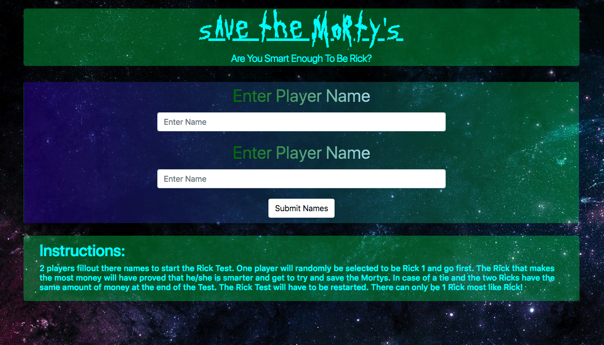
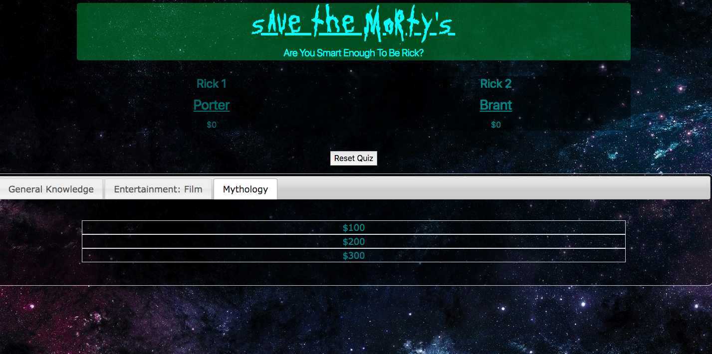
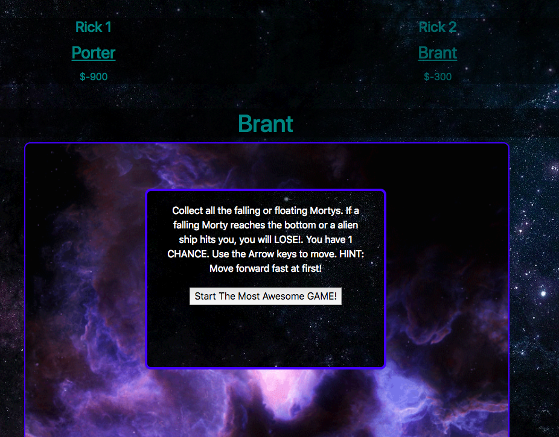
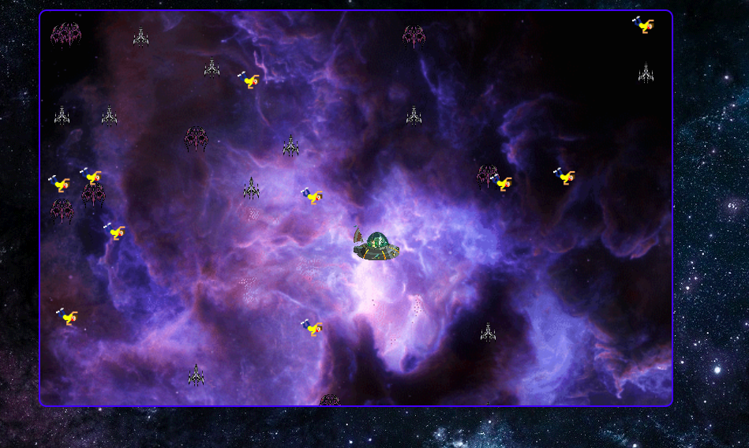
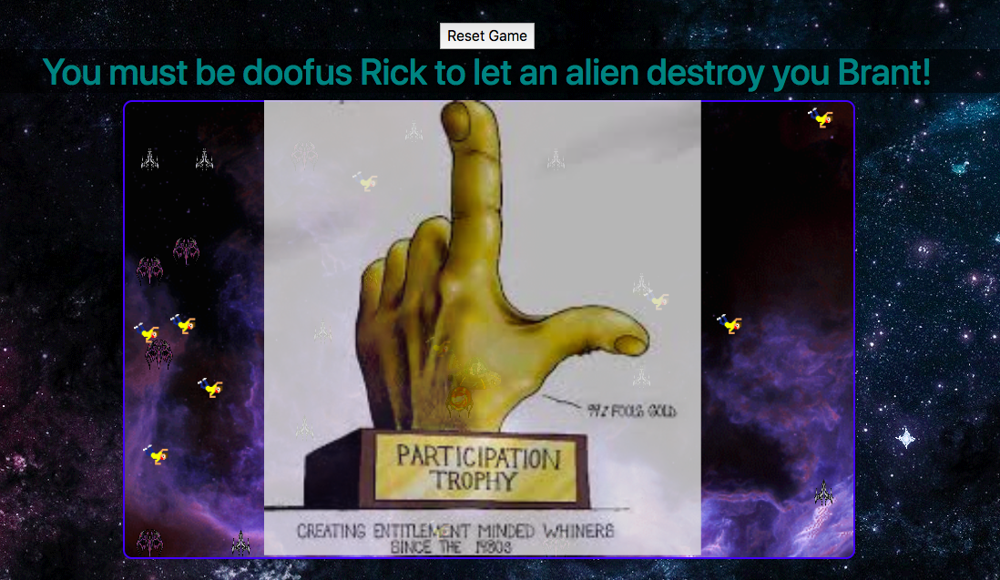

# Save The Mortys
Save the Mortys is a game built using html, css, JSON, and javascript. Bootstrap, jquery, and jquery ui were used in addition. I used a couple of free online sprites and made a couple of my own sprites using piskelapp.com for the canvas portion of the game. The information used in the quiz portion of the game comes from Open Trivia Database at https://opentdb.com/

The game can be play on https://brantchyoga.github.io/game_SaveMortys/

Or if you have a simple server you can git clone it from my repo at https://github.com/brantchyoga and run it on your server. I use node as my server to run the game on my labtop.

## Intructions
This is a two player game with 2 parts to the game. First players will have to fill in there names and then the quiz portion of the game will progress. There is a fifty percent chance either name will be picked to be to be player 1 and go first. This is an advantage since there is currently only 9 questions in the quiz. Each player will decide a category and then decide the monetary value they wish to bet by picking either the 100, 200 or 300 question. At the end of the quiz the player with the most money can proceed to the canvas game. In case of a tie, the quiz will have to be reset and players will have to enter in there names to start over. The player who wins the quiz will play the canvas game using the arrow keys to move up, down, side to side. There is a cheat to the game which I will not disclose. If the player collects all the falling mortys he will then have won. If his ship is hit by an alien ship or a single morty reaches the bottom of the canvas then he/she will lose and have to play all over again to get to the canvas game to try again.

## Name inputs

## Quiz Portion

## Winning Quiz Portion

## Canvas game

## Losing canvas game

## Future Improvements
1. Adding more questions to JSON files so the randomness of having the same question picked for categories will be lessened.
2. Adding more Categories
3. Introducing a tie breaking question instead of have a reset quiz button.
4. Additional styling for user experience and maybe more funny jokes to make the game more funny.

## Licensing 
Copyright of Brantchyoga. All rights reserved. This game is free for everyone.